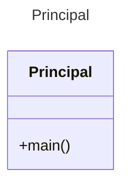
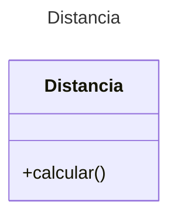

# Proyecto - Fundamentos de Programación: Conceptos Básicos
 
## Descripción del proyecto

Contiene una lista de ejercicios que comprende los conceptos básicos del lenguaje de programación Java.
Incorportandose a la estructura básica de un programa y demostrando características de: tipos de datos, literales, constantes, variales, identificadores, parámetros, operadores y salidas de datos.
Los ejercicios aquí descritos ya fueron diseñados en pseudocódigo y diagrama de flujo, basados en la metodología de las 6D.

## Ejecución

Tu programa debería ejecutarse de la siguiente manera:

```

```


## Diagrama de clases
[Editor en línea](https://mermaid.live/)


[Referencia-Mermaid](https://mermaid.js.org/syntax/classDiagram.html)

## Diagrama de clases UML con draw.io
El repositorio está configurado para crear Diagramas de clases UML con ```draw.io```. Para usarlo simplemente agrega un archivo con extensión ```.drawio.png```, das doble clic sobre el mismo y se activará el editor ```draw.io``` incrustado en ```VSCode``` para edición. Asegúrate de agregar las formas UML en el menú de formas del lado izquierdo (opción ```+Más formas```).
## Uso del proyecto con make

### Default - Compilar+Probar+Ejecutar
```
make
```
### Compilar
```
make compile
```
### Probar todo
```
make test
```
### Ejecutar App
```
make run
```
### Limpiar binarios
```
make clean
```
## Comandos Git-Cambios y envío a Autograding

### Por cada cambio importante que haga, actualice su historia usando los comandos:
```
git add .
git commit -m "Descripción del cambio"
```
### Envíe sus actualizaciones a GitHub para Autograding con el comando:
```
git push origin main
```
## Comandos individuales
### Compilar

```
find ./ -type f -name "*.java" > compfiles.txt ; javac -encoding utf-8 -d bin -cp lib/junit-platform-console-standalone-1.5.2.jar @compfiles.txt
```
### Ejecutar ambos comandos en 1 sólo paso:
```

```

### Ejecutar Todas la pruebas locales de 1 Test Case
```
java -jar lib/junit-platform-console-standalone-1.5.2.jar -class-path bin --select-class miTest.AppTest
```
### Ejecutar 1 prueba local de 1 Test Case
```
java -jar lib/junit-platform-console-standalone-1.5.2.jar -class-path bin --select-method miTest.AppTest#appHasAGreeting
```
### Ejecutar App
```
java -cp bin miPrincipal.Principal
```
Los comandos anteriores están considerados para un ambiente Linux. [Referencia.](https://www.baeldung.com/junit-run-from-command-line)